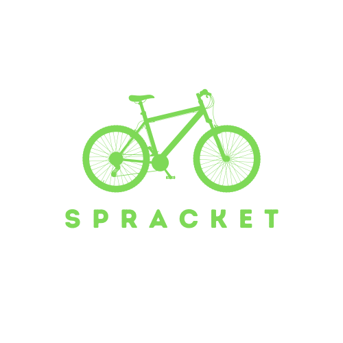
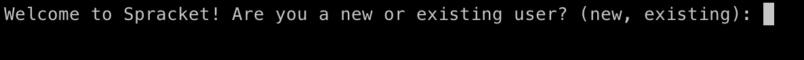

<a name="readme-top"></a>

[![Contributors][contributors-shield]][contributors-url]
[![Forks][forks-shield]][forks-url]
[![Stargazers][stars-shield]][stars-url]
[![Issues][issues-shield]][issues-url]
[![MIT License][license-shield]][license-url]
[![LinkedIn][linkedin-shield]][linkedin-url]

<br />
<div align="center">
  <a href="https://github.com/hillswor/spracket-cli">
    
  </a>

<h3 align="center">Spracket-CLI</h3>

  <p align="center">
    A CLI application built with Python and the Python Click library. Encompassing a range of functionalities, the interface allows users to sign up, curate an organized repository of bikes they own, and report any bike theft incidents. Navigate a database of stolen bikes via a comprehensive set of search parameters including city, state, and zip code, enabling users to quickly locate and track stolen bikes based on their preferred criteria.
    <br />
    <a href="https://github.com/hillswor/spracket-cli/issues">Report Bug</a>
    ·
    <a href="https://github.com/hillswor/spracket-cli/issues">Request Feature</a>
  </p>
</div>

<details>
  <summary>Table of Contents</summary>
  <ol>
    <li>
      <a href="#built-with">Built With</a></li>
    </li>
    <li>
      <a href="#getting-started">Getting Started</a>
      <ul>
        <li><a href="#prerequisites">Prerequisites</a></li>
        <li><a href="#installation">Installation</a></li>
      </ul>
    </li>
    <li><a href="#usage">Usage</a></li>
    <li><a href="#roadmap">Roadmap</a></li>
    <li><a href="#contributing">Contributing</a></li>
    <li><a href="#license">License</a></li>
    <li><a href="#contact">Contact</a></li>
    <li><a href="#acknowledgments">Acknowledgments</a></li>
  </ol>
</details>

### Built With

 [![Python][Python]][Python-url]


<p align="right">(<a href="#readme-top">back to top</a>)</p>


## Getting Started

First, install dependencies and enter your virtual environment:

```bash
$ pipenv install && pipenv shell
```
Change working directory to db:
```bash
$ cd lib
$ cd db
```
Create the database:
```
$ alembic upgrade head
```
Seed the database:
```bash
$ python seed.py
```
Change working directory to lib:
```bash
$ ..
```
Start the CLI using the following command:
```bash
$ python cli.py
```


<p align="right">(<a href="#readme-top">back to top</a>)</p>

## Usage

The app allows for new users to register and existing users to login:

<div align="center">
    
</div>

Once signed up or logged in the user will see the main menu with options:

<div align="center">
    
</div>


<p align="right">(<a href="#readme-top">back to top</a>)</p>

## Roadmap

- [ ] Adjust models to allow aquarium owners to share their aquariums
- [ ] Add CRUD functionality to the Post, Comment and WaterParameter models

See the [open issues](https://github.com/hillswor/spracket-cli/issues) for a full list of proposed features (and known issues).

<p align="right">(<a href="#readme-top">back to top</a>)</p>

## Contributing

Contributions are what make the open source community such an amazing place to learn, inspire, and create. Any contributions you make are **greatly appreciated**.

If you have a suggestion that would make this better, please fork the repo and create a pull request. You can also simply open an issue with the tag "enhancement".
Don't forget to give the project a star! Thanks again!

1. Fork the Project
2. Create your Feature Branch (`git checkout -b feature/AmazingFeature`)
3. Commit your Changes (`git commit -m 'Add some AmazingFeature'`)
4. Push to the Branch (`git push origin feature/AmazingFeature`)
5. Open a Pull Request

<p align="right">(<a href="#readme-top">back to top</a>)</p>

## License

Distributed under the MIT License. See `LICENSE.md` for more information.

<p align="right">(<a href="#readme-top">back to top</a>)</p>

## Contact

Bruce Hillsworth - [@bhillsworth](https://twitter.com/bhillsworth) - bruce.hillsworth@gmail.com

Project Link: [https://github.com/hillswor/spracket-cli](https://github.com/hillswor/namaka-server)

<p align="right">(<a href="#readme-top">back to top</a>)</p>

[contributors-shield]: https://img.shields.io/github/contributors/hillswor/spracket-cli.svg?style=for-the-badge
[contributors-url]: https://github.com/hillswor/spracket-cli/graphs/contributors
[forks-shield]: https://img.shields.io/github/forks/hillswor/spracket-cli.svg?style=for-the-badge
[forks-url]: https://github.com/hillswor/spracket-cli/network/members
[stars-shield]: https://img.shields.io/github/stars/hillswor/spracket-cli.svg?style=for-the-badge
[stars-url]: https://github.com/hillswor/spracket-cli/stargazers
[issues-shield]: https://img.shields.io/github/issues/hillswor/spracket-cli.svg?style=for-the-badge
[issues-url]: https://github.com/hillswor/spracket-cli/issues
[license-shield]: https://img.shields.io/github/license/hillswor/spracket-cli.svg?style=for-the-badge
[license-url]: https://github.com/hillswor/spracket-cli/blob/master/LICENSE.md
[linkedin-shield]: https://img.shields.io/badge/-LinkedIn-black.svg?style=for-the-badge&logo=linkedin&colorB=555
[linkedin-url]: https://linkedin.com/in/bruce-hillsworth
[product-screenshot]: images/screenshot.png
[Python]: https://img.shields.io/badge/Python-000000?style=for-the-badge&logo=python&logoColor=#3776AB
[Python-url]: https://docs.python.org/3/
